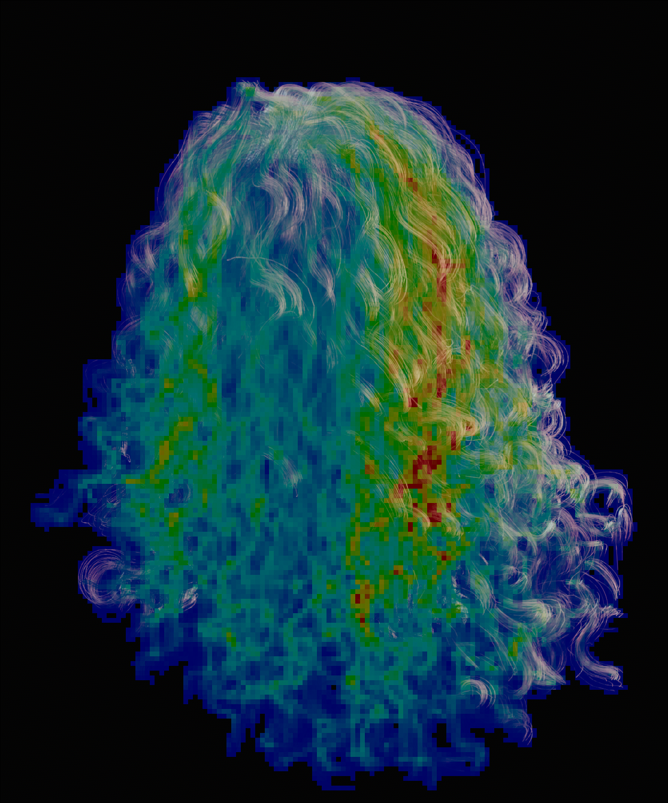
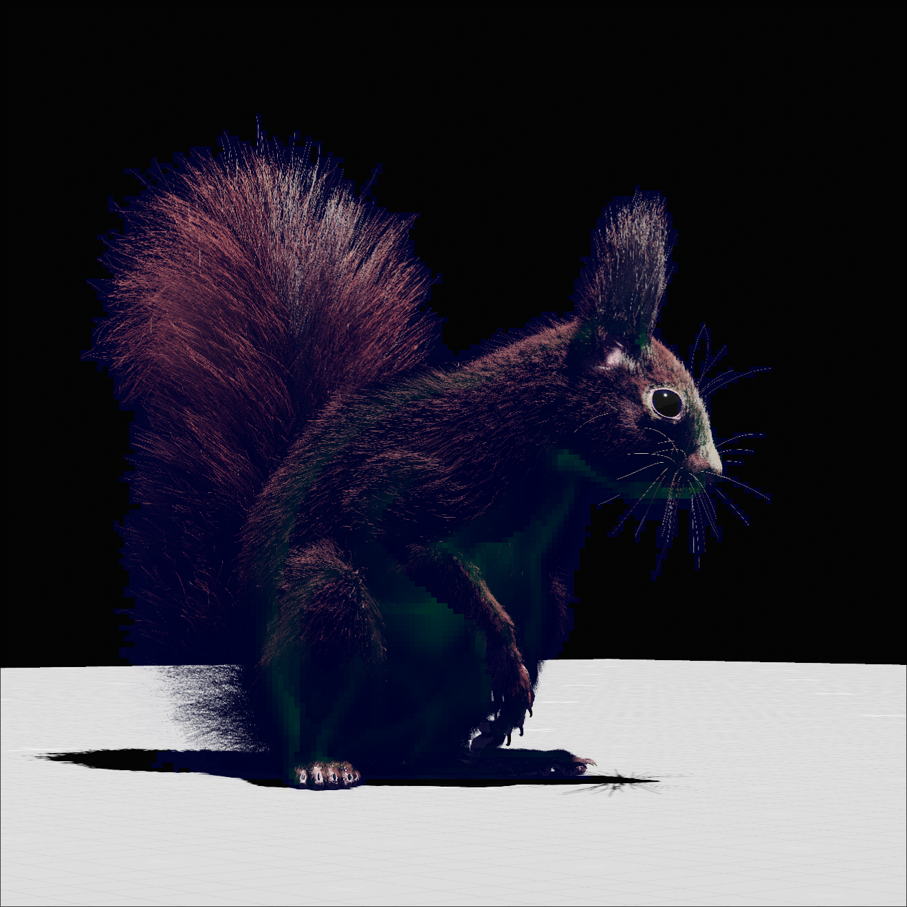
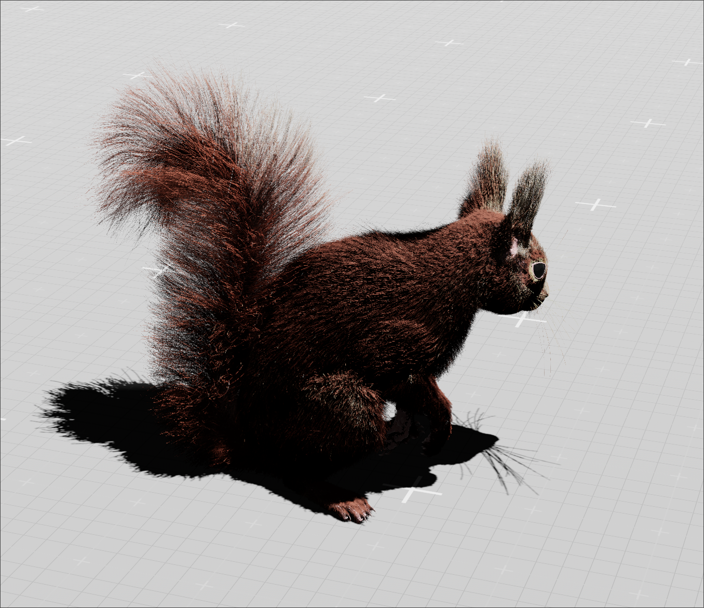

# Fiber
### Strand Software Rasterizer (Bevy)

This crate is a Bevy plugin that implements a **compute-based software rasterizer for strand geometry**.  
The runtime path is: prepass/work setup -> shadow -> shadow-stampback | shading -> strand raster -> composite.

## Repo map (quick)

- `src/plugin.rs`: main `StrandRasterizerPlugin` setup, render graph wiring, render-world resources/systems.
- `src/nodes/`: render graph compute nodes (`prepass`, `shadows`, `shading`, `raster`, `composite`, debug/sim variants).
- `src/pipelines/`: compute pipeline creation + bind group layouts/contracts per stage.
- `assets/shaders/`: WGSL kernels and shared shader includes used by the pipeline stages.
- `src/components.rs`: ECS-facing data (strand material/geometry, froxel config hooks, etc.).
- `src/resources.rs`: render resources/settings (tile debug, culling, intermediate buffers/state).
- `src/shader_types.rs`: host-side WGSL-compatible structs/push constants.
- `src/dson/`: DSF/DSO strand asset loading/parsing used by the demo app.
- `examples`: local demo harness that exercises the plugin in a Bevy app.

## Local dependency crates

- `crates/bevy_gpu_paging_allocator`: GPU paging allocator used for strand data slabs.
- `crates/bevy_vsms`: virtual surface/shadow map support integrated by the plugin.

## Examples

  
  

  
  
  

